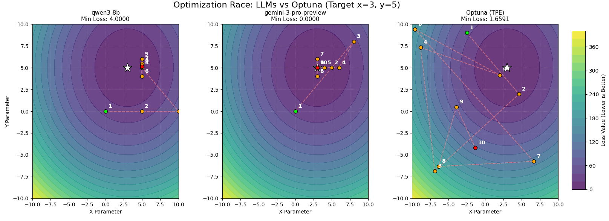

# Автоматическая оптимизация гиперпараметров под time-series forecasting с помощью LLM - написание агента.

LLM генерирует архитектуры, подбирая гиперпараметры, обучает модель Informer и выбирает лучший результат из записанных ею логов.

# Установка

```python
git clone github.com/dzaripov/arch_agent
cd arch_agent
uv sync
```
## Структура

- Informer2020 - модифицированный исходный код модели и датасет
- informer_tool.py - тул в формате OpenAI для вызова модели со всеми гиперпараметрами
- llm_optimization_informer.py - запуск ллм с тулом, идет оптимизация
- llm_optimization_informer_logs.py - запуск ллм с тулом с логированием
- llm_optimization_informer_updated.py - запуск ллм с тулом с измененным промптом, логированием и формированием дашборда
- [logs_history.log] - логи подбора через ллм
- [optuna_llm_logs.db] - дашборд Optuna
- test_llm_with_tools.py - тестовый пример запуска легкой оптимизации функции `(x-3)**2 + (y-5)**2`
- optuna_module.py - подбор гиперпараметров через Optuna
- example.py - запуск подбора гиперпараметров через Optuna
- llm_serve.sh - запуск sglang для локального инференса моделей
- `pyproject.toml`, `uv.lock` - файлы зависимостей

## Пример запуска

```python
uv sync
python llm_optimization_informer_updated.py
```

Не забудьте добавить свой ключ `OPENROUTER_API_KEY` в файл `.env` корневой папки.

## Результат

| Dataset  | Method   | MSE      | Best Parameters |
|----------|----------|----------|-----------------|
| ETTh1    | LLM      | 0.623    | {'d_model': 512, 's_layers': '3,2,1', 'mix': True, 'embed': 'timeF', 'n_heads': 4, 'patience': 3, 'factor': 3, 'padding': 0, 'e_layers': 2, 'distil': True, 'lradj': 'type1', 'activation': 'relu', 'attn': 'full', 'output_attention': False, 'seq_len': 96, 'label_len': 48, 'd_layers': 2, 'd_ff': 2048, 'dropout': 0.05, 'learning_rate': 0.0001, 'pred_len': 24} |
| ETTh1    | Optuna   | 0.730    | {'seq_len': 192, 'label_len': 96, 'pred_len': 24, 'd_model': 256, 'n_heads': 4, 'e_layers': 2, 'd_layers': 1, 'd_ff': 512, 'factor': 1, 'dropout': 0.01043092718503892, 'learning_rate': 2.657385677161264e-05, 'batch_size': 16, 'train_epochs': 6, 'patience': 4, 's_layers': '3,2,1', 'attn': 'full', 'embed': 'fixed', 'activation': 'gelu', 'distil': True, 'output_attention': False, 'mix': True, 'padding': 0, 'lradj': 'type1'} |

## Сравнение методов на простой задаче



## Вывод

LLM быстрее и эффективнее ищет лучшую архитектуру.
